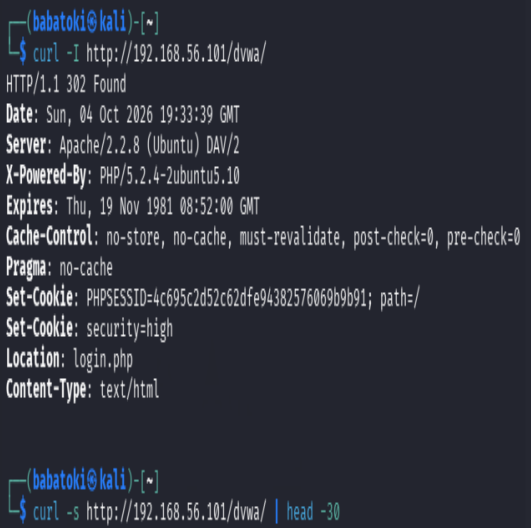
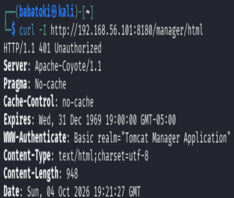
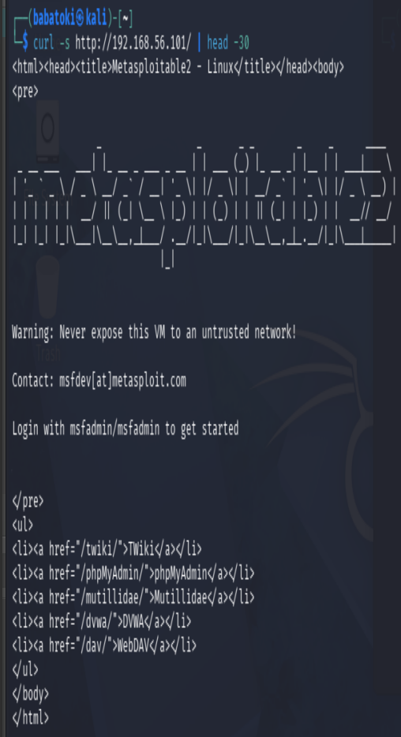

# NetSecure Scanner — Web Application Security Assessment

## Overview

NetSecure Scanner is a Python-based security assessment tool developed in a controlled cybersecurity laboratory environment. The project combines custom Python development with industry-standard security tools to identify exposed network services, perform service enumeration, classify security risks, and generate structured assessment reports.

The assessment was performed against a deliberately vulnerable Metasploitable 2 virtual machine hosting services including SSH, HTTP, MySQL, and Apache Tomcat.

> **Disclaimer:** This project was performed exclusively against intentionally vulnerable systems in an isolated laboratory environment for educational and authorized security testing purposes.

## Objectives

- Identify open TCP ports on a target system.
- Determine the services associated with exposed ports.
- Perform service and version enumeration.
- Identify potentially risky network services.
- Classify findings according to risk level.
- Generate human-readable and CSV security reports.
- Document reconnaissance and enumeration results.
- Demonstrate practical penetration-testing methodology.

## Technologies & Tools

| Technology | Purpose |
|---|---|
| Python 3 | Custom security scanner development |
| Kali Linux | Security testing environment |
| Nmap | Port and service enumeration |
| cURL | Web service testing |
| Metasploitable 2 | Intentionally vulnerable target |
| Git/GitHub | Version control and portfolio documentation |

## Lab Environment

The assessment was conducted using isolated virtual machines.

**Testing machine:**
- Kali Linux
- Python 3
- Nmap
- cURL

**Target machine:**
- Metasploitable 2
- IP address: `192.168.56.101`

The target was intentionally configured with vulnerable and exposed services for security testing.

## NetSecure Scanner

The custom scanner performs basic TCP port discovery and produces structured security findings.

Example:

```bash
python3 scanner.py 192.168.56.101
```

A custom port range can also be supplied:

```bash
python3 scanner.py -p 22,80,443,3306,8180 192.168.56.101
```

Display the available options:

```bash
python3 scanner.py --help
```

## Assessment Results

The assessment identified four open TCP ports:

| Port | Service | Risk |
|---:|---|---|
| 22 | SSH | Medium |
| 80 | HTTP | Medium |
| 3306 | MySQL | High |
| 8180 | Apache Tomcat | High |

### Service Enumeration

Nmap service enumeration identified:

- **22/tcp** — OpenSSH 4.7p1
- **80/tcp** — Apache HTTP Server 2.2.8
- **3306/tcp** — MySQL 5.0.51a
- **8180/tcp** — Apache Tomcat/Coyote 1.1

## Security Findings

### Medium — SSH Exposed

Port 22 was accessible over the network, exposing a remote administration service.

**Security consideration:** SSH should be restricted to trusted management networks where possible, with strong authentication and appropriate access controls.

### Medium — HTTP Without HTTPS

Port 80 exposed an HTTP web service without encrypted HTTPS communication.

**Security consideration:** Sensitive web traffic should use HTTPS with modern TLS configurations.

### High — MySQL Exposed

Port 3306 exposed a database service directly to the network.

**Security consideration:** Database services should generally be restricted to authorized application or administration networks rather than exposed broadly.

### High — Apache Tomcat Exposed

Port 8180 exposed an Apache Tomcat web application server.

**Security consideration:** Application-management interfaces should be restricted, securely configured, patched, and protected against unauthorized access.

## Reporting

The scanner generates both text and CSV reports.

Example report structure:

```text
reports/
├── scan_192.168.56.101_20261004_171756.txt
├── scan_192.168.56.101_20261004_172138.txt
├── scan_192.168.56.101_20261004_172400.txt
├── scan_192.168.56.101_20261004_172735.txt
└── scan_192.168.56.101_20261004_172735.csv
```

The reports document:

- Target information
- Scan timestamp
- Open ports
- Detected services
- Risk classifications
- Security findings
- Service banners/versions

## Project Structure

```text
NetSecure-Scanner/
├── scanner.py
├── README.md
├── REPORT.md
├── reports/
│   ├── *.txt
│   └── *.csv
└── screenshots/
    ├── reconnaissance/
    ├── enumeration/
    └── findings/
```

## Skills Demonstrated

This project demonstrates practical experience with:

- Network reconnaissance
- TCP port scanning
- Service enumeration
- Vulnerability identification
- Risk assessment
- Web application security testing
- Linux security tooling
- Python scripting
- Security documentation
- CSV/text report generation
- Git and GitHub
- Virtualized cybersecurity laboratories

## Future Improvements

Potential future versions of NetSecure Scanner could include:

- Multi-threaded scanning
- Configurable port ranges
- Banner grabbing improvements
- CVE mapping
- Automated vulnerability database lookups
- JSON report generation
- Improved risk scoring
- Web-based reporting dashboard
- Automated Nmap integration
- Authentication and credential auditing modules

## Ethical Use

NetSecure Scanner is intended for authorized security testing, cybersecurity education, and controlled laboratory environments.

Do not use this tool to scan systems or networks without explicit authorization.
## Evidence

The assessment included documented evidence from reconnaissance, enumeration, and web application security testing.

### Web Enumeration

Initial web enumeration was performed against the target web service.



### PHP Information Disclosure

The assessment identified accessible PHP configuration information.



### Directory Listing

Directory listing behavior was identified during web enumeration.


